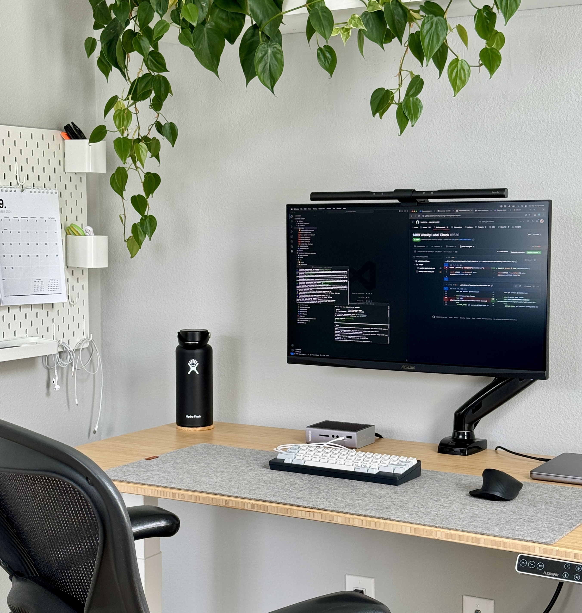

A detailed look at my workspace setup and the tools that help me stay productive.

## Workspace
My home office serves as both a productive workspace and a relaxation zone where I can listen to records, read books, or play games on my PC.

### What's on my Desk
- Desk: Flexispot Pro Plus E7 Standing Desk (bamboo top)
- Chair: Herman Miller Aeron (older model, found on OfferUp for $50)
- Deskmat: Grovemade wool deskpad 
- Monitor Light: BenQ ScreenBar

### Environment
My home office features a dual-desk setup: a primary workspace for work and daily tasks, and a secondary desk dedicated to gaming and tech experiments. The space is illuminated by two IKEA lamps - I've always appreciated IKEA's balance of quality and affordability.

## Hardware

### Primary Machine: MacBook Pro
- Model: M1 Pro 14-inch
- Specs: 16GB RAM, 1TB SSD
- Usage: The 16GB RAM configuration perfectly handles my development workflow, including VS Code, Figma, web browsing, and communication tools.

### Gaming PC
- CPU: AMD Ryzen 5800x
- GPU: NVIDIA 3070 Ti Founders Edition
- Memory: 32GB RAM, 2TB NVMe
- Case: Fractal Meshify C

### Display Setup
- Monitor: Dual ASUS VG27AQL1A 27-inch (one per desk)
- Specs: 1440p resolution, 144Hz refresh rate
- Mount: Amazon monitor arm

## Desk Gear & Audio

### Input Devices
- Keyboards: HHKB Type S, Realforce 87U (Topre switches are unmatched)
- Mice: Logitech MX Master 3, Logitech Pro X Superlight
- Dock: CalDigit TS3
- Headphones: Airpods Pro 2

### Audio Setup
- Monitors: JBL 305P MkII 5-inch Studio Monitors
- Microphone: Audio Technica AT2020
- Interface: Focusrite Scarlett 2i2 (secondary desk)
- Preamps: Schiit Mani & Sys
- Turntable: Technics 1200

## Software

### Development Environment
- Editor: VS Code
- Editor Theme: One Dark Modern
- Terminal: iTerm 2

### Daily Applications
- Browser: Chrome
- Launcher: Raycast
- Communication: Slack, Apple Messages, WhatsApp
- Organization: Notion (tasks and notes), Apple Notes
- Music: Apple Music

## Conclusion
I prefer a minimal, distraction-free setup where a single monitor provides sufficient screen space. Most of my equipment has been thoughtfully collected over years, each piece chosen for its specific purpose and value.

### Future Plans
- Monitor Upgrade: Considering the Apple Studio Display for its text clarity and color accuracy
- PC Update: Planning to migrate the current build to an ITX case

### Advice for Others
Build your setup gradually. Don't feel pressured to purchase trending items - focus on what works for you. Whether your space is meticulously organized or creative chaos, what matters is that it enables your productivity and reflects your personality.

