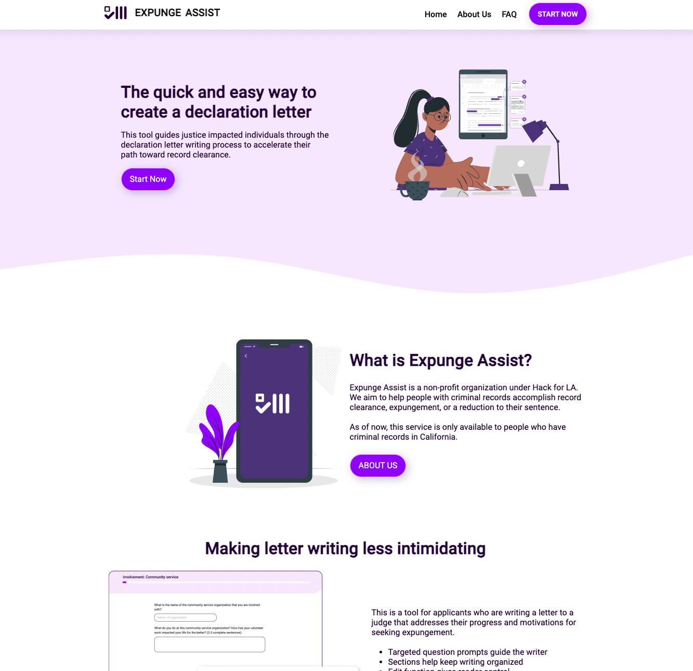

I joined Hack for LA with the intention of volunteering and contributing to open-source projects. I became part of the Expunge Assist project as a Frontend Developer. Expunge Assist is dedicated to aiding individuals with criminal records in California to reduce, dismiss, or seal their records in accordance with the provisions of Proposition 47 and Proposition 64.

Link to Github pages site: [Expunge Assist](https://expungeassist.org/)
