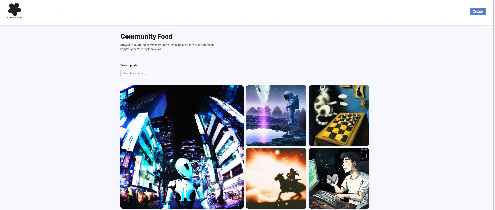

Inspire is an AI-powered image generation application, meticulously crafted using the MERN stack in tandem with the OpenAI API. Within this platform, users wield the power to forge exquisite AI-generated images, affording them the choice to either procure these visuals for personal use or generously share them within the burgeoning community.

Link to project: [Inspire ai](https://inspire-ai-hq.com/)
