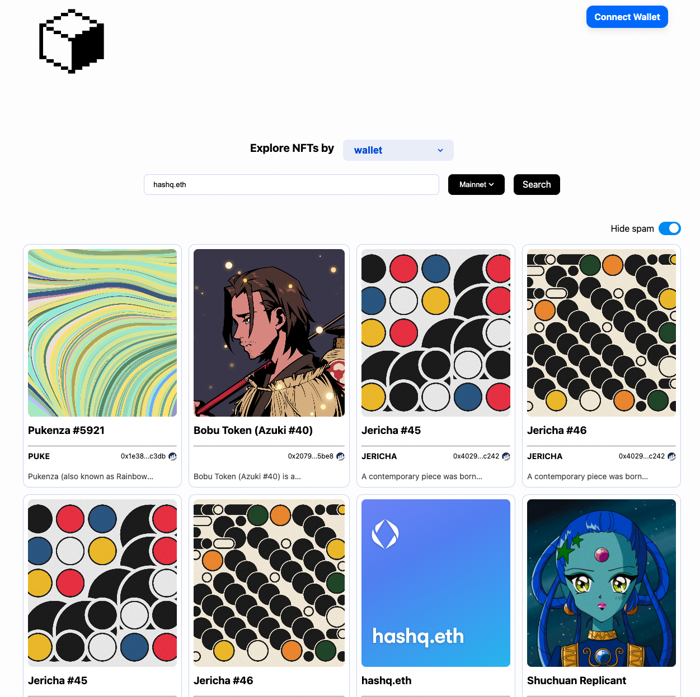

**JPEG Explorer: Advanced NFT Wallet Analysis on Ethereum**

JPEG Explorer is a high-performance application tailored for in-depth NFT wallet analysis within the Ethereum ecosystem. Merging Alchemy SDK, React, and Next.js, this platform empowers users with comprehensive insights into their NFT holdings.

**Key Components:**

- **Alchemy SDK Integration:** Seamless integration with Alchemy SDK ensures real-time Ethereum blockchain connectivity, enabling efficient data retrieval for accurate NFT wallet analysis.

- **React-Powered UI:** Built using React, the application offers a modular UI structure for fluid navigation through NFT portfolios, enhancing user experience.

- **Optimized with Next.js:** Leveraging Next.js optimizes loading times and UI responsiveness, contributing to an overall efficient application performance.

**Noteworthy Features:**

- **Visual Profiling:** JPEG Explorer offers visual NFT previews, preserving the nuances of each digital asset and its unique characteristics.

- **Comprehensive Insights:** Gain detailed analytics covering asset valuations, historical trends, and rarity metrics, facilitating informed decision-making.

- **Real-Time Sync:** Seamlessly link Ethereum wallets to enable real-time updates, ensuring up-to-the-moment accuracy of NFT portfolio status.

Link to project: [Jpeg Explorer](https://jpeg-explorer.vercel.app/)
