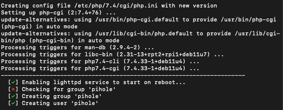
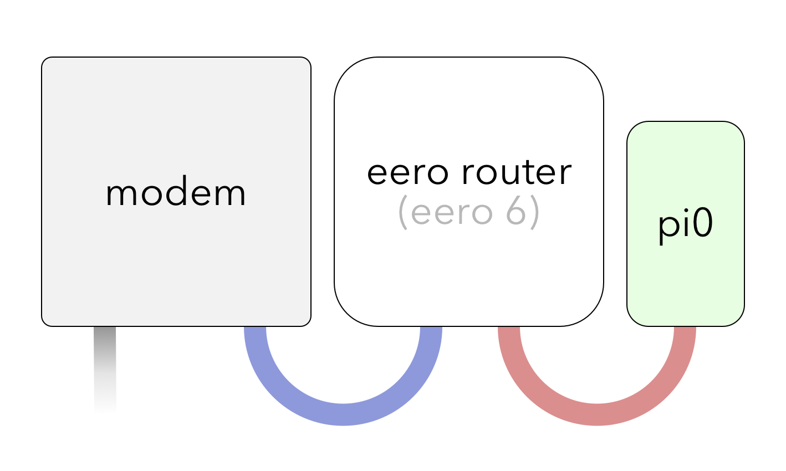
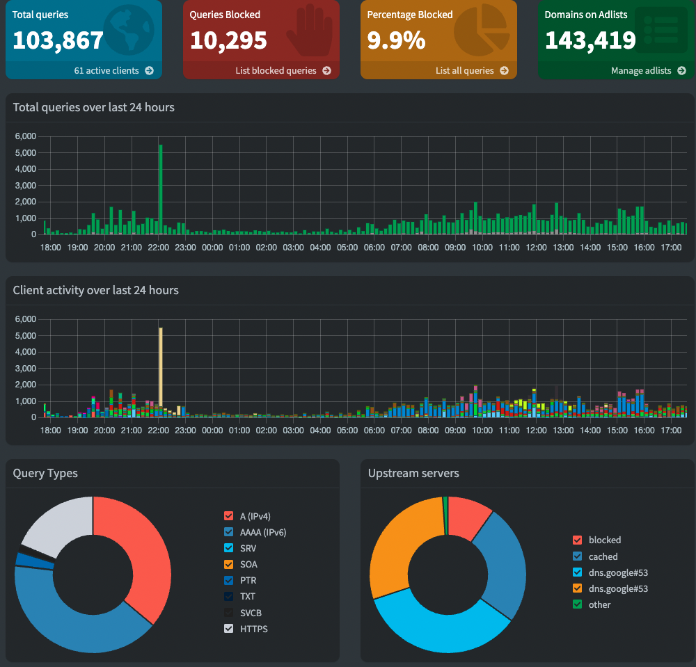

I’ve always been intrigued by various tech and have been a tinkerer my whole life. Recently, after moving, I set a goal to build a system that can incorporate my smart home from a single machine and create a dashboard displaying various info and stats.

### **The Start of the Homelab**

I don’t want to go all out. My goal is to create a low-powered home lab system that can run 24/7 with little to no interruptions. I decided that other things could wait, and the start of it could be setting up a Pi-hole for my home network.

### **What's a Pi-Hole?**

Imagine having a personal guardian for your home network—one that keeps unwanted guests (ads and trackers) at bay, ensuring a smoother, safer online experience. That's exactly what a Pi-hole does.

In straightforward terms, a Pi-hole is like a digital bouncer for your internet connection. It's a small, cost-effective device (often a Raspberry Pi) that filters out pesky advertisements and tracking elements before they even reach your devices. This means fewer annoying pop-ups, enhanced privacy as you browse the web, and faster internet speeds. Running a Pi-hole could also be done through some Docker containers, which I hope to learn more about in the future.

### **First Steps**

I used a Raspberry Pi 3, which I bought from eBay for a relatively cheap price, around USD 30. You can use cheaper models like the Pi Zero for lower costs. The first step was getting the OS installed on the Pi, which is easy to do thanks to the [Raspberry Pi Imager](https://www.raspberrypi.com/software/). After choosing the correct OS, the imager will run through a few options: you can enable SSH, add your home network to the device, and more. I chose to use SSH with the device so I could access it through my terminal instead of plugging a display directly into the Raspberry Pi.

### **Running Some Scripts and Installing Pi-hole**

There are some update/upgrade scripts you’ll want to run after getting connected to the Pi; those are:

`sudo apt update`

… and if updates are available, install them via:

`sudo apt upgrade`

Installing Pi-hole is the easy part

`curl -sSL https://install.pi-hole.net | bash`

After running the script, your terminal will run through the installation process. Once it's finished, you can safely shut down the Pi with:

`sudo shutdown now`

### **Hardware Side**

I opted not to use the wireless Wi-Fi on my Pi and went with a wired Ethernet connection to one of the Eero routers I have in my home.

Make sure you connect the Pi to an available Ethernet port on the back of your router. I included this diagram above to show you how I’m connecting everything. The blue Ethernet cable goes from the modem to the router, and the red Ethernet cable goes from the router directly into the Pi.

### **Pi-Hole Admin Dashboard**

The dashboard for your Raspberry Pi can be accessed by its IP address and also the username and password you set up during the installation. In the dashboard, you can whitelist queries the Pi may be blocking, view the total queries, and also blocked queries, the percentage blocked by the Pi, and more. I find the dashboard to be really useful and also kind of cool.

This was from after the Pi had been running for about 24 hours.

### Additional Tips and Considerations

- **Static IP:** Consider assigning a static IP address to your Pi-hole for consistent access.
- **Backup Settings:** Once your Pi-hole is set up, take a moment to back up your settings. It can save time if you ever need to reinstall or migrate your Pi-hole.
- **Explore Blocklists:** Customize your Pi-hole's blocklists based on your preferences. There are various community-curated blocklists available for different purposes.

### **Closing Thoughts**

While none of this might be groundbreaking, I genuinely hope that someone across the internet finds this information helpful! As I move forward with my home lab journey, my next steps involve venturing into Linux. I plan on building a low-powered small form factor PC to serve as both a media server and a hub for Home Assistant integration. Additionally, I'm eager to delve deeper into the realm of Linux, learning more about Docker containers, and exploring the possibilities that Kubernetes offers. The journey continues, and I'm excited to share the discoveries along the way.
