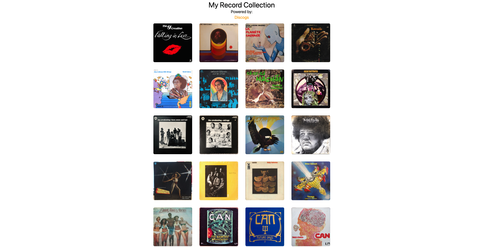

Introducing a nifty app that puts my record collection in the spotlight, pulling data straight from the Discogs API. Each album on display is a clickable gem, unlocking a trove of additional information like genre tags, recording year, and convenient links to Apple Music – perfect for seamless streaming if the album is up for grabs.

Link to project: [Record Collection](https://my-record-collection-hq.vercel.app/)
